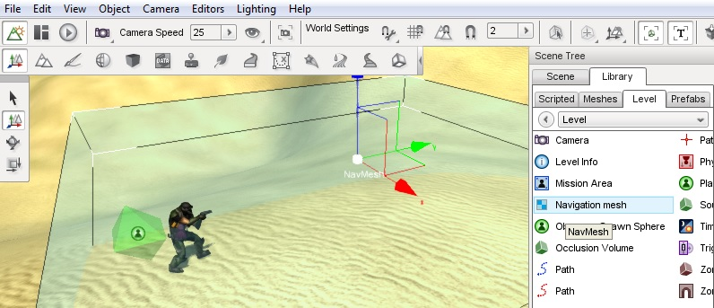

# Using Recast navigation

Torque 3D 3.5 includes basic support for automatic navmesh generation using the open-source [Recast library][recast].
Using Recast, you define the size of a navmesh region in your level,
and the engine will automatically generate a mesh of walkable surfaces.
You can then navigate on this mesh using Detour (a component of/companion to Recast).

This tutorial will show you how to create and use navmeshes in your levels.
It has two parts: setting up the level, and setting up scripts.
It is based on the Full template.

 [recast]: https://github.com/memononen/recastnavigation

# 0. Software

Make sure you have [Torque 3D version 3.5][t3d] and the [Project Manager version 2.1][pm],
(unless you know what you're doing without it!).

 [t3d]: https://github.com/GarageGames/Torque3D/wiki/Torque-3D-Archive
 [pm]: https://github.com/GarageGames/Torque3D/wiki/Project-Manager-Archive

# 1. Level setup

## Creating a new project

If you don't have a project set up with Torque 3D 3.5 already,
I direct you to the Torque 3D [wiki page][new project] on setting up a new project.
However, we need to perform one additional step before clicking the <kbd>Create</kbd> button.
Click on <kbd>Choose modules</kbd>, then scroll down and tick the box beside 'Recast Navigation'.
Like this:

Then create and compile your project as usual.

 [new project]: https://github.com/GarageGames/Torque3D/wiki/Creating-a-New-Project-Based-on-a-Template

## Adding a navmesh to a level

Open up your project, and from the main menu, open the 'Empty Terrain' level.
Open the world editor, and in the Library, under the 'Level' tab in the 'Level' folder,
double-click the 'Navigation mesh' entry.
A navmesh should appear in your level like so:

Using the world editor, scale and position your navmesh so that it covers some area of the level.
Ensure that the navmesh entirely surrounds objects of interest like the terrain.
I also chose to add some obstacles using the convex shape editor.

## Building the navmesh

Now that you have defined the boundary of the navmesh in your level, you can build it,
generating the actual mesh used to find paths.
At the moment, this can only be done from the console, so either give your navmesh a name or note its ID number from the object inspector.
In the console, type:

    Nav.build();

Where `Nav` is the name of your navmesh, or its ID number.
You should see the navmesh turn red, and a mesh appear inside it.
It will turn blue once all tiles have been built.
Your navmesh should now look something like this:

Note that the mesh may extend past the boundaries you have defined.
This will happen if your navmesh's size does not divide evenly by its `tileSize` (a property you can set using the inspector).
You might also see 'bald' patches where the blue navmesh surface sinks underneath the terrain.
Don't worry!
The navmesh still exists and provides an adequate representation for pathfinding.
When the navmesh is simplified to a lower detail than the terrain polygons, sometimes sharp corners are cut off.

## Saving the navmesh

It'd be no good if you had to rebuilt your navmesh each time you opened the level.
But the good news is you don't have to!
If you specify a `fileName` in the inspector, when you save the level, your navmesh's data will be written to that file,
and loaded from it when the level is next loaded.

Note that the path is relative to the engine executable.
Be careful to give every navmesh in all your levels a unique name, or they'll overwrite each other's data!
I like to save my meshes in

    levels/level_name.navmesh_name.nm

(Of course, sometimes you might _want_ the navmesh to be built every time the level loads - for example,
if you are generating level content procedurally.)

# 2. Scripting with navmeshes

## The NavMesh class

The `NavMesh` class really only has one script method you'll want to use: `build`.
It takes a single argument, a boolean which determines whether the mesh will be built asynchronously.
It defaults to `true`, which causes the behaviour you saw just before - the navmesh tiles appear sequentially while the engine continues to run normally.
If you pass `false` here, the entire engine will pause while the mesh is rebuilt.
This results in a faster build.

## The NavPath class

Most of your pathfinding scripts will revolve around `NavPath`.
This class represents a traversable route through a single `NavMesh`.
Here's a minimal example of creating a `NavPath` in a script:

    %p = new NavPath() {
       from = "10 5 1";
       to = "-8 9 1";
       mesh = Nav;
    };

These three fields are the most important ones to set when creating a path.
`from` and `to` are, of course, the coordinates you want to find a path between.
`mesh` is the `NavMesh` object that the path should use.
In this case I refer to the `NavMesh` named `Nav`.
I recommend you always name your navmeshes for this reason.

Of course, it will often be the case that you create `NavPath`s with reference to at least one object -
an `AIPlayer` who will be doing the path following.
So your member initialisation will often look more like this:

       from = %obj.getPosition();
       to = %pos;

rather that containing hardcoded locations.

Once you have created a `NavPath`, if it is valid (i.e. it has a `mesh` and its `from` and `to` positions are on that mesh*),
the path will automatically be found and you can skip to the next section.
If the construction was invalid, or if you change the path's properties and need to update it, you can use the `replan` method:

    %p.replan();

## Following a path

Once you have a `NavPath`, you'll need to get your `AIPlayer` to walk along it.

## Differences between Path and NavPath

A point of confusion for many is the two 'Path' classes in Torque - `Path` and `NavPath`.
`Path` is older and existed in Torque before the navigation code was added with `NavPath`.
It represents a sinple sequence of points, which are often interpolated between.
In the editor, a `Path` looks like a smooth curve of green markers.
It does not do any automatic pathfinding - it simply stretches between points you lay out by hand.

A `NavPath`, on the other hand, looks like a thin pink line in the editor.
It plans automatically between two points, given a `NavMesh` to work on.

You should use `Path` for objects that have to travel pre-defined, smooth trajectories,
such as fly-through cameras, cutscene events like jets flying overhead, etcetera.
You should use `NavPath` for character navigation.
